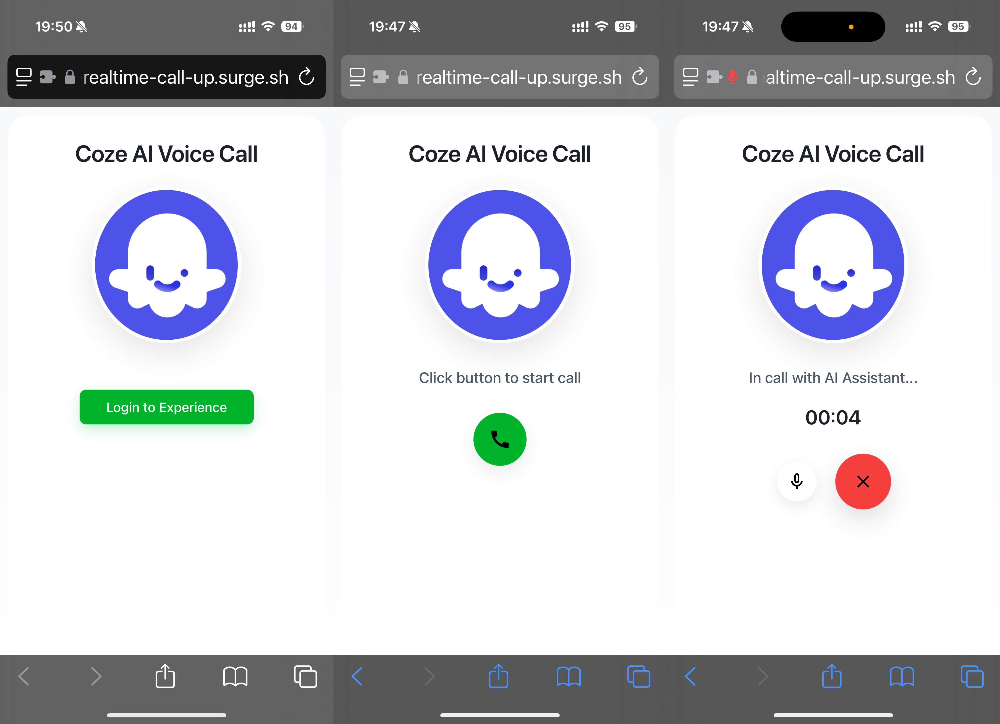

# Quick Start

## Prerequisites
1. Ensure you have Node.js (v18+) installed

## Running the Demo

```bash
npm run run-preinstall
npm install
npm run start
```



## Demo Features
1. Visit [http://localhost:3000](http://localhost:3000)
2. Optional: Use browser extensions for custom headers during testing
3. Grant microphone permissions when prompted
4. Initialize connection via the "Start Call" button
