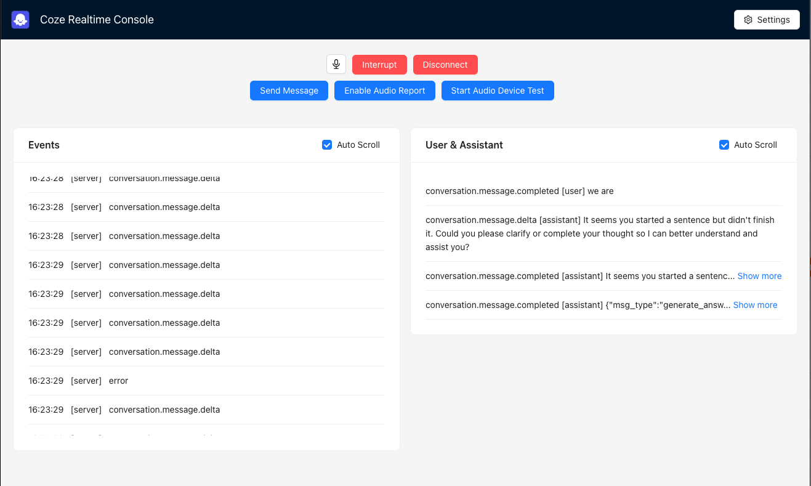

# Quick Start

## Prerequisites
1. Set up your development environment following the [coze-js](../../README.md#development-guide) guide
2. Ensure you have Node.js (v18+) installed

## Running the Demo

```bash
rush update
rush build
npm run start # disable video by default

# or set enable video to true
REACT_APP_ENABLE_VIDEO=true npm run start  # for macos/linux
# Windows users should use either:
set "REACT_APP_ENABLE_VIDEO=true" && npm run start  # for windows cmd
$env:REACT_APP_ENABLE_VIDEO="true"; npm run start   # for windows powershell

```



## Demo Features
1. Visit [http://localhost:3000](http://localhost:3000)
2. Configure your credentials in the settings panel:
   - Access Token
   - Bot ID
   - Voice ID
   - API Base URL
3. Optional: Use browser extensions for custom headers during testing
4. Grant microphone permissions when prompted
5. Initialize connection via the "Connect" button

## Available Operations
- Microphone control (toggle on/off)
- Bot interaction interruption
- Connection management
- Audio debugging tools:
  - Playback device monitoring
  - Device status logging
  - Diagnostic features

## Monitoring
- Real-time event logging in the upper console
- Bot response display in the lower panel
- Detailed console logs for debugging

