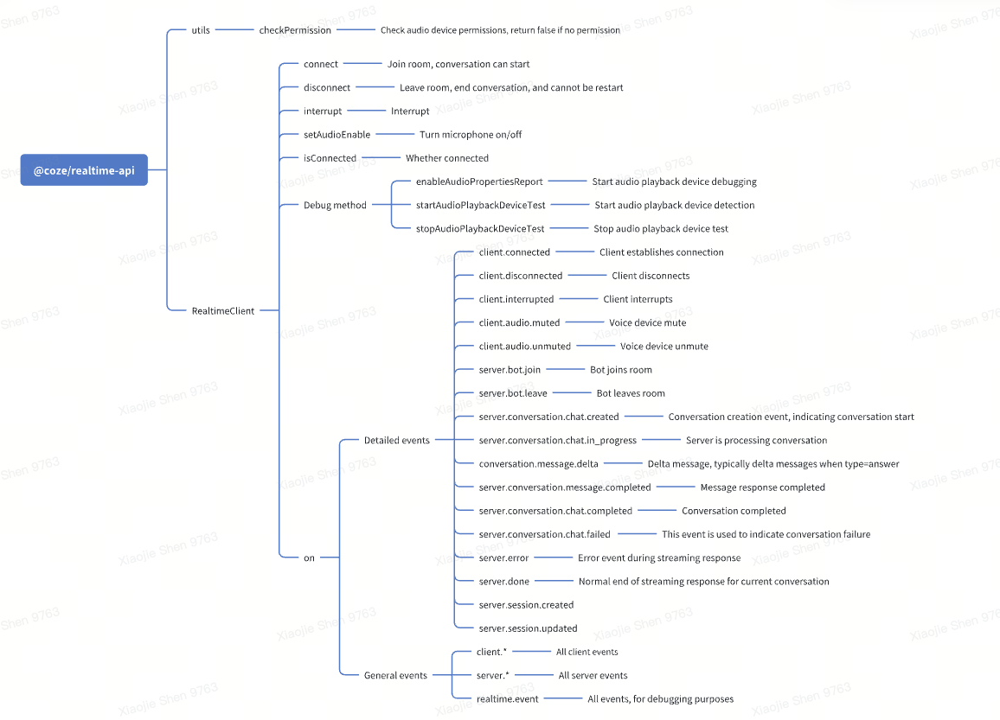

# Coze Realtime API

[](https://www.npmjs.com/package/@coze/realtime-api)
[](https://www.npmjs.com/package/@coze/realtime-api)
[](https://github.com/coze-dev/coze-js/blob/main/LICENSE)
[](https://www.typescriptlang.org/)
[](https://github.com/coze-dev/coze-js/pulls)

A powerful real-time communication SDK for voice interactions with Coze AI bots.

## Features
1. Precise Speech Recognition: Leveraging large language models for ASR (Automatic Speech Recognition), our system offers contextual understanding capabilities. It can reference previously mentioned terms, understand speaking styles and references, and delivers enhanced recognition accuracy in challenging scenarios including noise, domain-specific terminology, and mixed Chinese-English speech.

2. Powerful AI Agent Capabilities: As an AI Agent development platform, Coze provides comprehensive agent functionalities including:
   - Memory systems (file storage, databases, variables)
   - Knowledge integration (text, tables, images)
   - Skills (plugins, triggers)
   - Workflow orchestration (task flows, image processing pipelines)

3. Low Latency: Implemented using RTC (Real-Time Communication) technology to minimize latency throughout the communication pipeline.

4. Natural Voice Synthesis: Using advanced TTS (Text-to-Speech) models powered by large language models, our system:
   - Intelligently predicts emotional context and intonation
   - Generates ultra-natural, high-fidelity, personalized voice output
   - Excels in naturalness, audio quality, prosody, breathing patterns, and emotional expression
   - Handles mixed Chinese-English content seamlessly
   - Delivers human-like expression of modal particles and emotional nuances



## Installation

```bash
npm install @coze/realtime-api
# or
yarn add @coze/realtime-api
```

## Quick Start

```ts
import { RealtimeClient, EventNames, RealtimeUtils } from "@coze/realtime-api";

// Initialize the client
const client = new RealtimeClient({
  baseURL: "https://api.coze.cn",
  accessToken: "your_access_token",
  // or
  // accessToken: async () => {
  //   // refresh token if expired
  //   return 'your_oauth_token';
  // },
  botId: "your_bot_id",
  voiceId: "your_voice_id",           // Optional: Specify voice ID
  conversationId: "conversation_id",   // Optional: For conversation continuity
  debug: true,                        // Optional: Enable debug logging
  allowPersonalAccessTokenInBrowser: true,  // Optional: Enable PAT token usage in browser
  audioMutedDefault: false,           // Optional: Initial audio state (default: false)
  suppressStationaryNoise: false,     // Optional: Enable stationary noise suppression(default: false)
  suppressNonStationaryNoise: false,  // Optional: Enable non-stationary noise suppression(default: false)
});

// Essential Setup
async function initializeVoiceChat() {
  // 1. Verify device permissions
  const hasPermission = await RealtimeUtils.checkPermission();
  if (!hasPermission) {
    throw new Error("Microphone access required");
  }

  // 2. Establish connection
  await client.connect();
}

// Core Operations
const operations = {
  disconnect: () => client.disconnect(),
  interrupt: () => client.interrupt(),
  toggleMicrophone: (enabled: boolean) => client.setAudioEnable(enabled),
  checkConnection: () => client.isConnected
};

// Event Handling
function setupEventListeners() {
  // Listen to all events
  client.on(EventNames.EventNames, console.log);

  // Client-side events only
  client.on(EventNames.ALL_CLIENT, console.log);

  // Server-side events only
  client.on(EventNames.ALL_SERVER, console.log);

  // Specific event handling
  client.on(EventNames.CONNECTED, (event) => {
    console.log("Connection established:", event);
  });
}
```

## Example
For a complete working example, check out our [realtime console demo](../../examples/realtime-console).
